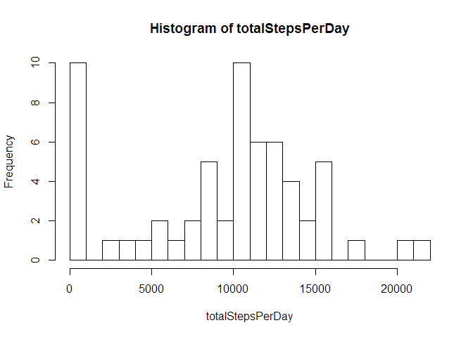
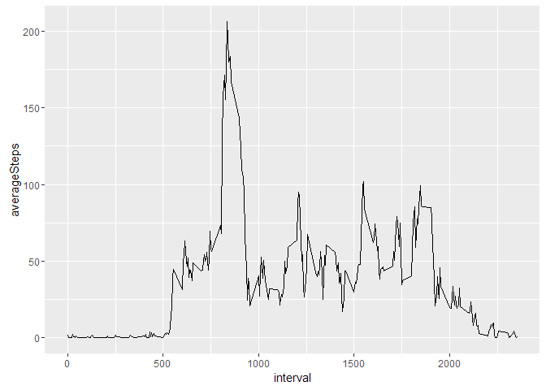
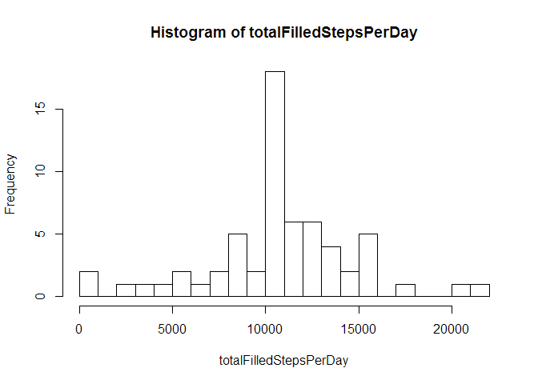
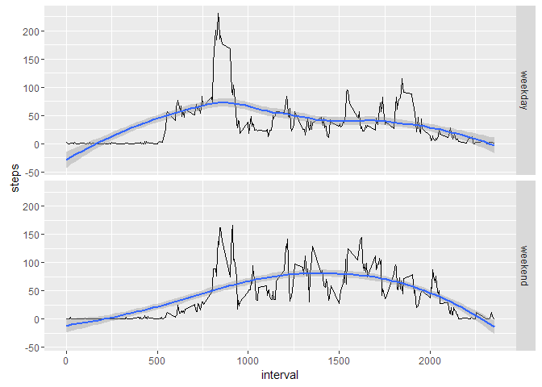

# Reproducible Research: Peer Assessment 1


## Loading and preprocessing the data

```r
unzip(zipfile = "activity.zip")
stepdata <- read.csv("activity.csv")
stepdata$date <- as.Date(stepdata$date)
```


## What is mean total number of steps taken per day?

```r
totalStepsPerDay <- tapply(stepdata$steps,stepdata$date,sum,na.rm=T)
hist(totalStepsPerDay,25)
```



```r
summary(totalStepsPerDay)
```

```
##    Min. 1st Qu.  Median    Mean 3rd Qu.    Max. 
##       0    6778   10400    9354   12810   21190
```

## What is the average daily activity pattern?

```r
library(ggplot2)
averageByInterval <- aggregate(list(averageSteps = stepdata$steps),
                               list(interval = stepdata$interval),
                               mean,na.rm=T)
ggplot(data = averageByInterval,aes(interval,averageSteps)) + geom_line()
```



Which 5-minute interval, on average across all the days in the dataset, contains the maximum number of steps?

```r
maxStepsInterval <- which.max(averageByInterval$averageSteps)
averageByInterval[maxStepsInterval,]
```

```
##     interval averageSteps
## 104      835     206.1698
```

## Imputing missing values
Show a table of missing data.  The "True" column represents missing data

```r
isMissingInterval <-is.na(stepdata$steps)
table(isMissingInterval)
```

```
## isMissingInterval
## FALSE  TRUE 
## 15264  2304
```

Let's fill in the missing values with the averages for that interval.  We've already calculated the averages in "averageByInterval" and locations of the missing entries.  So now we just fill those locations with their corresponding averages.


```r
filledStepdata <- stepdata;
for (i in which(isMissingInterval)) {
        intervalNeedingReplacement <- stepdata$interval[i]
        replacementVal <- averageByInterval$averageSteps[averageByInterval$interval==intervalNeedingReplacement]
        filledStepdata$steps[i] <- replacementVal
}
```

Let's see what the histogram, mean, and median look like for the filled data.

```r
totalFilledStepsPerDay <- tapply(filledStepdata$steps,filledStepdata$date,sum,na.rm=T)
hist(totalFilledStepsPerDay,25)
```



```r
summary(totalFilledStepsPerDay)
```

```
##    Min. 1st Qu.  Median    Mean 3rd Qu.    Max. 
##      41    9819   10770   10770   12810   21190
```

Looks like both the median and mean are higher after filling in the data.  The missing values, which were treated as 0 when computing total steps, have been replaced with non-zero values.  

## Are there differences in activity patterns between weekdays and weekends?
Let's first add a factor indicating if it's a weekday or a weekend.  

Here's a function to compute the factor value from a string date

```r
weekdayOrWeekend <- function(s) {
        dayOfWeek <- weekdays(s,F)
        res<-"weekday"
        if (dayOfWeek %in% c("Saturday","Sunday")) {res<-"weekend"}
        return (res)
}
```

Now let's add the factor.  


```r
filledStepdata$dayType <- sapply(filledStepdata$date,weekdayOrWeekend)
```

Now let's plot.  We can use the formula notation to make this a little easier.


```r
averageByIntervalAfterFill <- aggregate(data = filledStepdata,steps ~ interval + dayType, mean)
ggplot(data = averageByIntervalAfterFill,aes(interval,steps)) + geom_line() + facet_grid(dayType~.) + geom_smooth()
```



Looks like there are differences between weekend and weekday activities.  
